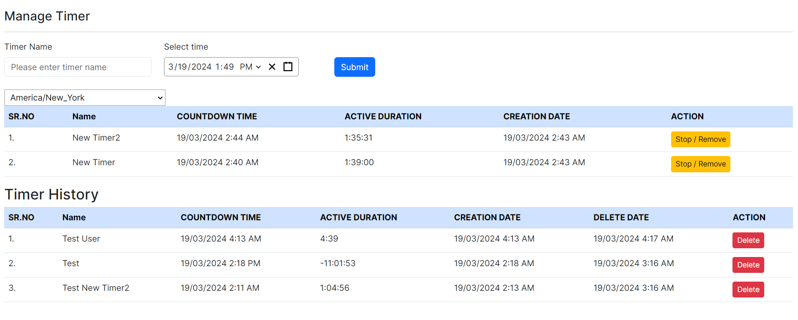

# Next.js 13 CRUD

This repository contains a simple Next.js 13 application that demonstrates a timer in React / Next that has a countdown timer feature and a world clock.
And host the project to check on github. (Create, Read, Update, Delete) operations. The application allows users to perform basic CRUD actions on a dataset, providing a practical example of how to implement these operations using Next.js 13.

## Features

- Create: Add new timer to the dataset through a user-friendly interface
- View: View the existing dataset and browse through the items.
- Update: Edit the information of any timer in the dataset effortlessly.
- Delete: Remove timer from the dataset with a confirmation prompt


## Countdown Timer
1) enter a start time and the countdown starts upon clicking a "start" button
2) add and remove a timer to/from a list of timers and each timer will
have its own progress of the countdown
3) Do not use 3rd party libraries for the implementation of the timer logic (e.g. no useCountdown from usehooks-ts)
4) Store timer information in MongoDB & The same need to be listed through restful API on the timer page as listing history which include timer Name, Creation date, Delete date & Active duration till it stopped or paused by the user.

## Demo

A live demo of the application is available at --
https://github.com/Gaurav-Lambha/nextjs-react-mongo-timer


## Installation

- Clone the repository to your local machine.
  Install my-project with npm

```bash
git clone https://github.com/Gaurav-Lambha/nextjs-react-mongo-timer
cd nextjs-react-mongo-timer
```

- Install the dependencies using npm or yarn.

```bash
npm install
# or
yarn install
```

- Start the development server.

```bash
npm run dev
# or
yarn dev
```

- Open your browser and navigate to http://localhost:3000 to access the application.

## Technologies Used

- Next.js 13
- MongoDB
- Mongoose
- React Hook Form
- Bootstrap

## Acknowledgments

Thanks to the Next.js team for providing a powerful framework for building modern web applications.

Happy coding! 🚀:




